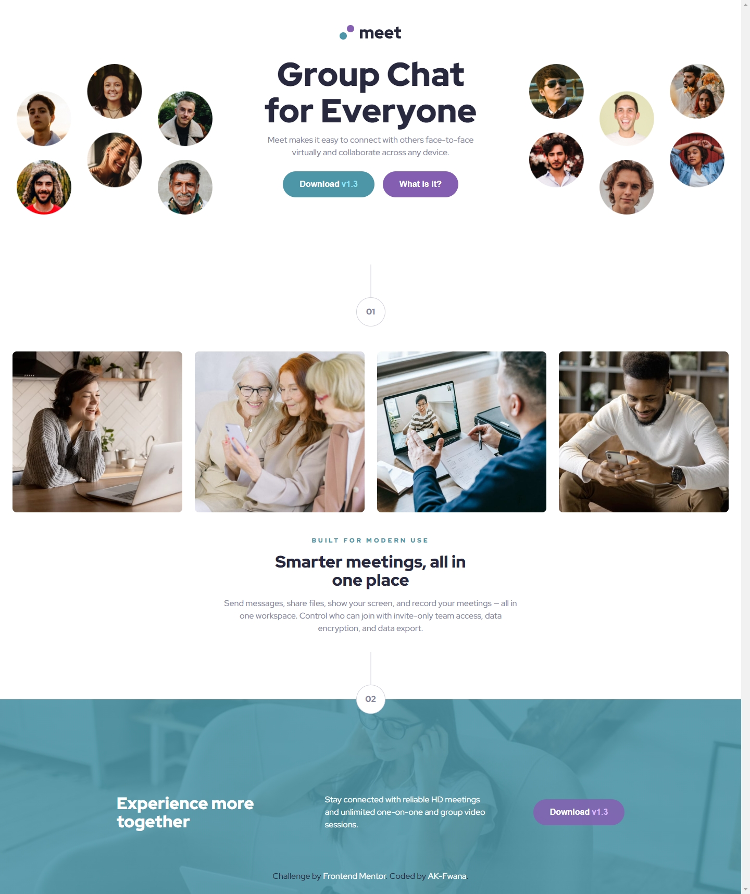
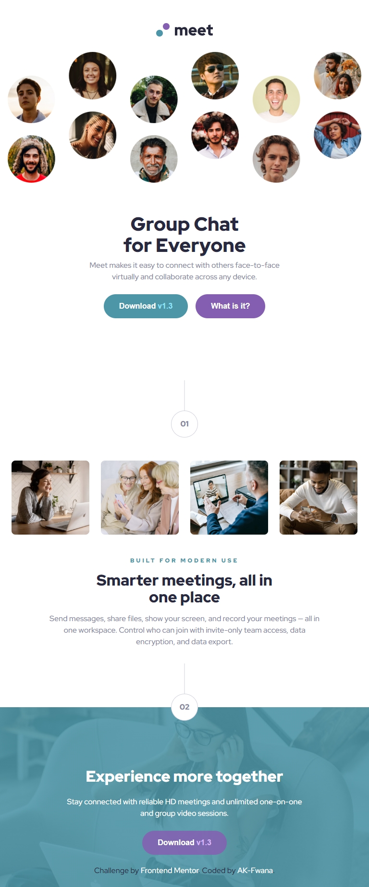
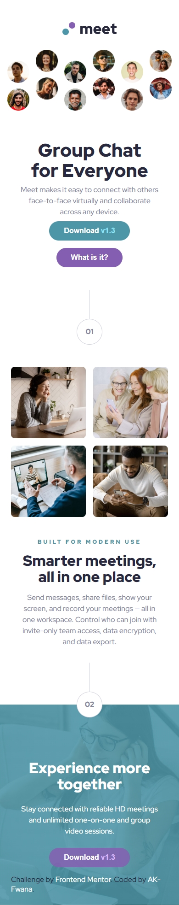

# Frontend Mentor - Meet landing page solution

This is my solution to the Meet landing page challenge on Frontend Mentor.
Frontend Mentor challenges help me improve my coding skills by building realistic projects.

## Table of contents

- [Overview](#overview)
  - [The challenge](#the-challenge)
  - [Screenshot](#screenshot)
  - [Links](#links)
- [My process](#my-process)
  - [Built with](#built-with)
  - [What I learned](#what-i-learned)
  - [Continued development](#continued-development)
  - [Useful resources](#useful-resources)
  - [AI Collaboration](#ai-collaboration)
- [Author](#author)

**Note: Delete this note and update the table of contents based on what sections you keep.**

## Overview

### The challenge

Users should be able to:

- View the optimal layout depending on their device's screen size
- See hover states for interactive elements

### Screenshot

### Links

- Solution URL: [Add solution URL here](https://github.com/AK-Fwana/Meet-landing-page)
- Live Site URL: [Add live site URL here](https://ak-fwana.github.io/Meet-landing-page/)

## My process

### Built with

- Semantic HTML5 markup
- CSS custom properties
- Flexbox
- CSS Grid
- Mobile-first workflow
- Responsive images and background images
- Media queries

### What I learned

During this project, I improved my understanding of responsive layouts, asset management, and screen-specific image handling.
I learned how to switch hero and footer images across mobile, tablet, and desktop screens without inventing missing assets.

I also practiced using semantic HTML, CSS variables, pseudo-elements, hover states, and mobile-first media queries.

### Continued development

I want to continue improving my responsive design skills, especially with complex hero layouts, background image positioning, and spacing consistency across breakpoints.

### Useful resources

- [MDN Web Docs](https://developer.mozilla.org/) - Helped me understand responsive images, media queries, and CSS layout behavior.
- [Layout by Brad Woods](https://layout.bradwoods.io/) - Helped me think more clearly about layout spacing and responsive structure.

### AI Collaboration

I used ChatGPT to guide the project workflow, review my HTML and CSS structure, debug layout issues, and improve responsive behavior step by step.

## Author

- GitHub - [AK-Fwana](https://github.com/AK-Fwana)
- Frontend Mentor - [@AK-Fwana](https://www.frontendmentor.io/profile/AK-Fwana)
